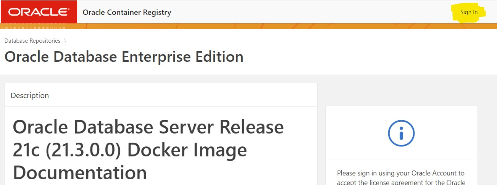
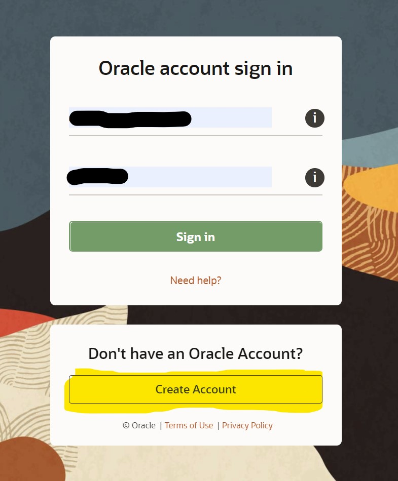
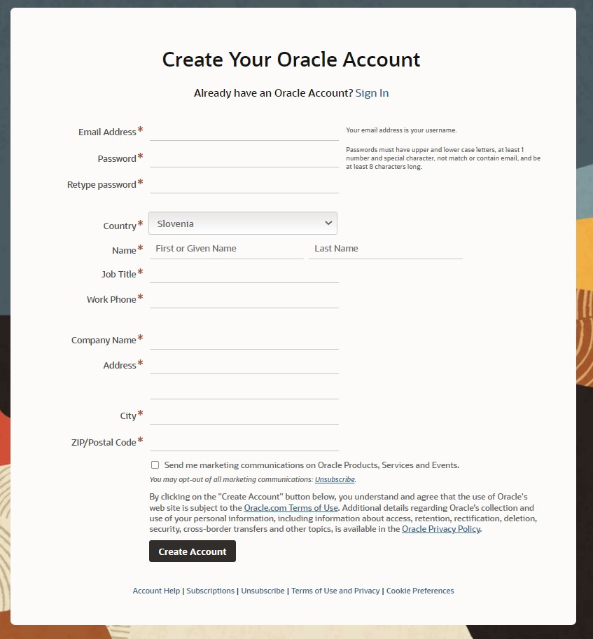
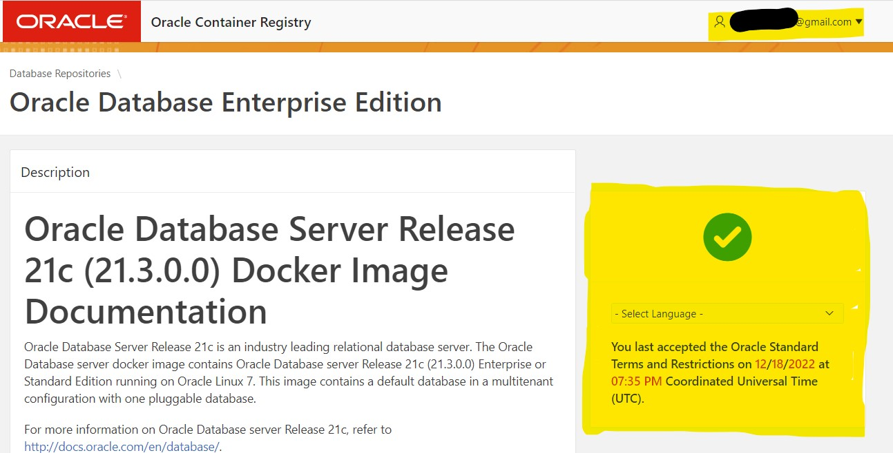
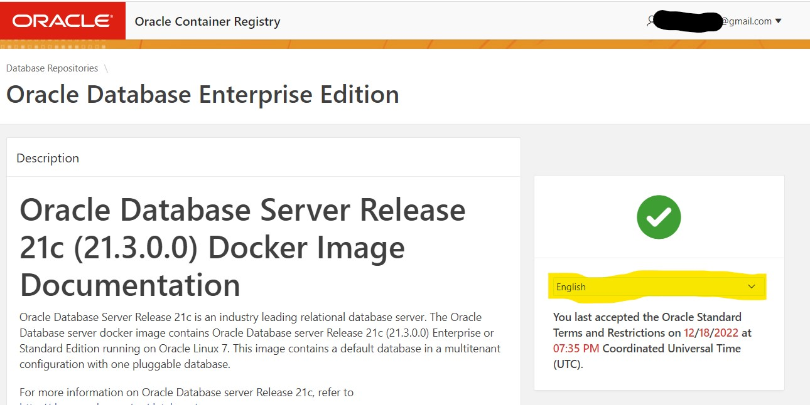
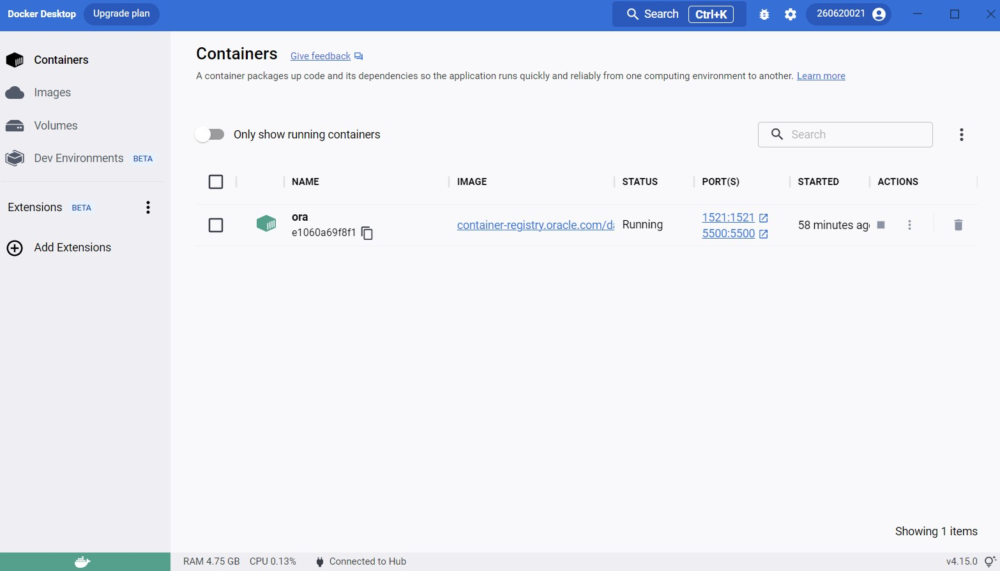
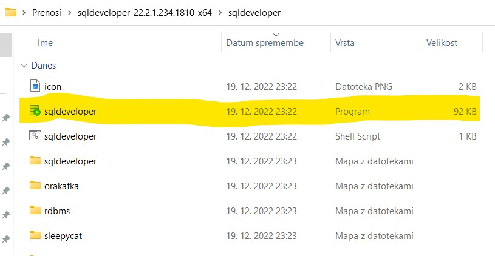
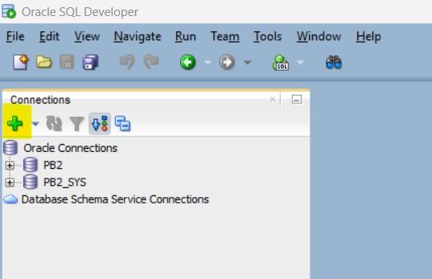
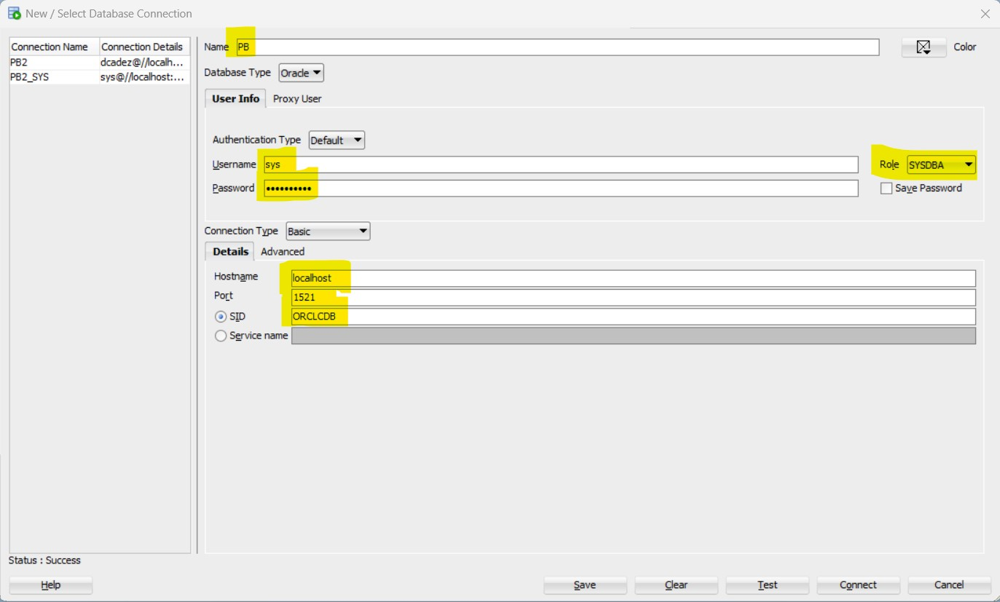

# Namestitev Oracle 21c podatkovne baze v Docker

<br>

## Namestitev Dockerja

S spletne strani [docker.com](https://www.docker.com/) si prenesite aplikacijo Docker Desktop.

Da preverite, ali je bila inštalacija Docker-ja uspešna odprite ` terminal` in vnesite ukaz `docker --version`. V primeru da dobite izpis, ki je podoben spodnjemu, ste Docker uspešno namestili.

```
david@iLoveNutella:~$ docker --version
Docker version 20.10.21, build baeda1f
```

Osnovni ukazi in informacije o Docker-ju so na voljo na na [na tej povezavi](https://docker-curriculum.com/)

<br>

## Namestitev Oracle 21c podatkovne baze

Najprej je porebno na [Oracle Container Registry-ju](https://container-registry.oracle.com/ords/f?p=113:4:5090964780066:::4:P4_REPOSITORY,AI_REPOSITORY,AI_REPOSITORY_NAME,P4_REPOSITORY_NAME,P4_EULA_ID,P4_BUSINESS_AREA_ID:9,9,Oracle%20Database%20Enterprise%20Edition,Oracle%20Database%20Enterprise%20Edition,1,0&cs=3yyn9D7ko6d7W4BGa6_oWQQi00KvzP-U62cUhAx7SmjWwwBLcAx8nZlQdaZeWQ4YKIFD49ysp_3uieAlco8d1jw) poiskati ustrezno bazo. Ko odprete povezavo kliknite na `Databse` in nato na `enterprise`.

Sedaj si moramo ustvariti Oracle Account. V zgornjem desnem kotu boste videli gum z napisom **Sign In**, kliknite nanj.



Nato se vam bo odprlo prijavno okno, kliknite na **Create Account**.



Odprlo se vam bo okno za registracijo. Vnesite vse potrebne podatke (tiste ki jih poznate), za tiste vnose kot so "Job Title", "Work hone", "Company Name" itd. si pa izmislite poljubne vrednosti. Nazadnje kliknite na create Account.



Sedaj ko imate narejen Oracle račun se prijavite z njim (če niste že avtomatsko prijavljeni). Če ste naredili vse pravilno bi mogli videti nekaj takšnega.



Nato izberite jezik, jaz sem za ta primer izbral _"English"_.



Sedaj lahko potegnemo Docker Image iz Oracle Container Registry-ja. Da to naredimo v terminalu poženemo spodnji ukaz:

```
docker run -d --name ora  --restart always   -p 1521:1521 -p 5500:5500   container-registry.oracle.com/database/enterprise:21.3.0.0
```

Po izvedbi tega ukaza bi mogli imeti v Docker Desktopu zagnan container z imenom `ora`.



Da se bomo lahko povezali na bazo moramo `SYS` uporabniku spremeniti geslo. To naredimo s spodnjim ukazom.

```
$ docker exec ora ./setPassword.sh <your_password>
```

`<your_password>` zamenjajte s svojim geslom.

<br>

## Namestitev SQL developer-ja za povezavo na bazo

S spletne strani [https://www.oracle.com/database/sqldeveloper/technologies/download/](https://www.oracle.com/database/sqldeveloper/technologies/download/) prenesite SQL Developer, ki vam bo omogočal, da se povežete na bazo. Svetujem vam, da si naložite sledečo različico: `Windows 64-bit with JDK 11 included`.

Ko bose datoteko prenesli ekstrahirajte njeno vsebino v na poljubno mesto v vašem računalniku (jaz sem jo kar v mapo "prenosi").

V mapi boste dobili program `sqldeveloper`.



Sedaj, ko imamo nameščen `sqldeveloper` moramo vzpostaviti povezavo na bazo.
To naredimo tako da v `sqldeveloper` kliknemo na zelem `+`.



Odprlo se nam bo okno, kjer vpišemo vse potrebne parametre za povezavo na bazo.



Vse parametre lahko prepišete iz slike, le geslo je takšno kot ste si ga nastavili.

Nato kliknite na gumb `Test`. V primeru, da ste vse pravilno naredili se vam bo v spodnjem levem kotu prikazal `Status: Success`. Nato kliknite na `Save`.

Sedaj se povežite na bazo preko povezave, katero ste pravkar ustvarili. Ko ste povezani, v `sqldeveloper` obvezno izvedi naslednji ukaz, ki bo omogočil kreiranje novih uporabnikov:

```
alter session set "_ORACLE_SCRIPT"=true;
```

Nato kreirajte administratorja z naslednjimi ukazi:

```
CREATE USER NewDBA
IDENTIFIED BY passwd;

GRANT DBA TO NewDBA WITH ADMIN OPTION;
```

`NewDBA` predstavlja uporabniško ime za administratorja baze, `passwd` pa geslo, ki ga boste administratorju dodelili.

Na koncu obvezno izvedi ukaz:

```
commit;
```

Sedaj se lahko prijaviš kot prej definiran administrator.
