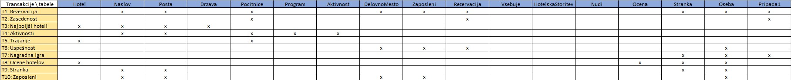

# 2. domača naloga - Turistična agencija

### David Čadež, Luka Žohar

## K2.1: Za entitetne tipe kreiraj relacije:

Z orodjem `PowerDesigner 12.5` smo popravljen konceptualni model preslikali v logičnega. Dobili smo logični model s sedemnajstimi relacijami.

V preslikanem logičnem logičnem modelu je bilo potrebno popraviti nekaj stvari in sicer:

1. V relaciji `Stranka` smo izklopili primarni ključ na atributu `EMSO` in pobrisali njegov indeks. Le ta je bil potreben, saj v naprotnem primeru mi `PowerDesigner 12.5` mi pustil izvesti preslikave v logični model.

2. Med relacijama ` Naslov` in `Hotel`, kjer je `1:1` povezava je `PowerDesigner 12.5` naredil ciklično povezavo med tema dvema relacijama. Zato je bilo potrebno izbrati relacijo v katero bo šel tuji ključ. Odločili smo se, da bo tuji ključ šel v relacijo `Hotel`.

Glede sestavljenih atributov imamo samo enega - `Naslov`. Le tega smo že na konceptualnem nivoju razbili na več relacij (`Drzavo`, `Posto`, `Naslov`), tako da tukaj ni bilo posebnosti pri preslikavi (samo tuji ključi so se preslikali v ustrezne relacije).

Imamo pa en izpeljan atribut; to je `Ocena` hotela, ki se ga izračuna kot povprečje atributa `tocke` iz relacije `Ocena` in zaokroži na celo število. Da, se bo izpeljan atrubi vedno posodabljal, smo na fizičnem nivoju dodali bazni prožilec, ki bo skrbel za to.

## K2.2: Preveri relacije z normalizacijo

Mi smo že na konceptualnem nivoju strmeli k temu, da so bile naše relacije v 3. normalni obliki. Pri pregledu relacij, nismo opazili, da kašna relacija nebi bila v 3. normalni obliki. Posledično v tem koraku ni bilo potrebno narediti nobenih popravkov.

## K2.3: Preveri relacije s pregledom uporabniških transakcij

Pri pregledu uporabniških transakcij smo ugotovili, da naš model zdrži vse uporabniške transakcije. Prav tako smo tudi ugotvili, da bi bilo dobro naše transakcije malo dodelati, saj v nasprotnem primeru nebi imeli kam postavljati smiselnih sekundarnih indeksov v koraku `K4`. Tako da naše transakcije niso ravno enake tistim iz 1. domače naloge.

## K2.4: Preveri omejitve integritete:

V tem koraku smo ugotovili, da imamo dve kritični povezavi in sicer:

1. Povezava med relacijama `Drzava` in `Pocitnice`, saj morajo počinice potekati v isti državi v kateri se nahaja hotel. Tukaj bi bilo pametno, dati še en prožilec, ki preveri da je država počitnic enaka državi v kateri se nahaja hotel.

2. Povezava med relacijama `Rezervacija` in `HotelskaStoritev`, saj iz načrta lahko razberemo da ne vsi hoteli nudijo vseh hotelskih storitev. Zato moramo biti previdni da na rezervacijo, ki se nanaša na neke počitnice ne vežemo hotelske storitve, katere hotel v katerem se bodo počitnice odvijane, ne izvaja. Težavo bi lahko spet odpravili z prožilcem ki preveri ali podani hotel izvaja določeno storitev.

Ostale stvari štimajo.

## K3.2: Izdelaj načrt predstavitve izpeljanih atributov

Odločili smo se, da bomo atribut `OcenaHotela` iz relacije `Hotel` izračunavali kot povprečno vrednost atributa `Tocke` iz relacije `Ocena` zaokroženo na celo število. Za posodabljanje izpeljanega atributa, bo skrbel bazni prožilec.

## Transakcije

Spodaj so v `SQL-u` zapisane vse transakcije:

```sql
--TRANSAKCIJA 1
--Za vsako rezervacijo izpišite podatke o imenu potovanja, na katerega se nanaša in podatke o potnikih (ime, priimek, naslov, datum rojstva, EMŠO in številko osebne izkaznice), znesku plačila in zaposlenem (ime, priimek in delovno mesto), ki je rezervacijo odobril. Rezervacije naj bodo urejene po znesku plačila padajoče in id rezervacije narascajoce.
SELECT r.idRezervacija, p.ime AS "Ime počitnic",
(
    SELECT o1.ime
    FROM oseba o1
        INNER JOIN zaposleni z
            ON o1.idOseba = z.idOseba
    WHERE z.idOseba = r.idOseba
) AS "Ime zaposlenega",
(
    SELECT o1.priimek
    FROM oseba o1
        INNER JOIN zaposleni z
            ON o1.idOseba = z.idOseba
    WHERE z.idOseba = r.idOseba
) AS "Priimek zaposlenega",
(
    SELECT dm.naziv
    FROM delovnomesto dm
        INNER JOIN zaposleni z
            ON dm.iddelovnomesto = z.iddelovnomesto
    WHERE z.idOseba = r.idOseba
) AS "Delovno mesto zaposlenega",
o.ime, o.priimek, o.kratica, o.postnaStevilka, po.kraj , o.ulica, o.hisnaStevilka, s.emso, s.stosebneizkaznice, r.znesekPLacila
FROM oseba o
    INNER JOIN naslov n
        ON o.kratica = n.kratica AND o.postnaStevilka = n.postnaStevilka
           AND o.ulica = n.ulica AND o.hisnaStevilka = n.hisnaStevilka
    INNER JOIN posta po
        ON n.kratica = po.kratica AND n.postnaStevilka = po.postnaStevilka
    INNER JOIN stranka s
        ON s.idOseba = o.idOseba
    INNER JOIN pripada_1 p1
        ON p1.idOseba = s.idOseba
    INNER JOIN rezervacija r
        ON p1.idRezervacija = r.idRezervacija
    INNER JOIN pocitnice p
        ON p.idPocitnice = r.idPOcitnice
ORDER BY  r.znesekPLacila DESC, r.idRezervacija ASC;
```

```sql
--TRANSAKCIJA 2
--Izpišite ime potovanja, odhod, prihod, trajanje, število vseh mest in število prostih mest, ki so še na voljo za vsa potovanja, ki so v ponudbi (to so tista potovanja, katerih datum odhoda je večji od trenutnega datuma - 1 teden).
SELECT p.ime AS "Ime počintnic", p.odhod, p.prihod, (p.prihod - p.odhod) AS "Trajanje", p.steviloProstihMest AS "Število vseh mest",  p.steviloProstihMest - (
    SELECT COUNT(pripada_1.idOseba) AS "Zasedena mesta"
    FROM pripada_1
        INNER JOIN rezervacija
            ON rezervacija.idRezervacija = pripada_1.idRezervacija
        INNER JOIN pocitnice
            ON rezervacija.idPocitnice = pocitnice.idPocitnice
    WHERE p.idPocitnice = pocitnice.idPocitnice
) AS "Število prostih mest"
FROM pocitnice p
WHERE p.odhod > (CURRENT_DATE + 7);
```

```sql
--TRANSAKCIJA 3
--Izpišite imena, naslove in povprečno oceno desetih najbolje ocenjenih hotelov.
SELECT *
FROM (
    SELECT d.naziv AS "Država", h.ime AS "Ime hotela", h.ocenaHotela AS "Ocena hotela"
    FROM hotel h
        INNER JOIN naslov n
            ON h.kratica = n.kratica AND h.postnaStevilka = n.postnaStevilka
               AND h.ulica = n.ulica AND h.hisnaStevilka = n.hisnaStevilka
        INNER JOIN posta p
            ON n.kratica = p.kratica AND n.postnaStevilka = p.postnaStevilka
        INNER JOIN drzava d
            ON p.kratica = d.kratica
    ORDER BY h.ocenaHotela DESC
    )
WHERE ROWNUM <= 10;
```

```sql
--TRANSAKCIJA 3
--Izpišite imena, naslove in povprečno oceno desetih najbolje ocenjenih hotelov.
SELECT *
FROM (
    SELECT d.naziv AS "Država", h.ime AS "Ime hotela", h.ocenaHotela AS "Ocena hotela"
    FROM hotel h
        INNER JOIN naslov n
            ON h.kratica = n.kratica AND h.postnaStevilka = n.postnaStevilka
               AND h.ulica = n.ulica AND h.hisnaStevilka = n.hisnaStevilka
        INNER JOIN posta p
            ON n.kratica = p.kratica AND n.postnaStevilka = p.postnaStevilka
        INNER JOIN drzava d
            ON p.kratica = d.kratica
    ORDER BY h.ocenaHotela DESC
    )
WHERE ROWNUM <= 10;
```

```sql
--TRANSAKCIJA 4
--Za vsako potovanje v ponudbi (to so tista potovanja, katerih datum odhoda je večji od trenutnega datuma - 1 teden) izpišite ime potovanja in podatke o programu/aktivnostih, ki se bodo izvajale tekom potovanja. Za vsako aktivnost vemo naziv, opis, kraj in datum izvedbe.
SELECT p.ime AS "Ime počintnic", p.odhod, p.prihod, pr.datumIzvedbe AS "Datum izvedbe aktivnosti", po.kraj "Kraj izvedbe aktivnosti", a.naziv "Aktovnost", a.opis
FROM pocitnice p
    INNER JOIN program pr
        ON pr.idPocitnice = p.idPocitnice
    INNER JOIN aktivnost a
        ON pr.idAktivnost = a.idAktivnost
    INNER JOIN naslov n
        ON a.kratica = n.kratica AND a.postnaStevilka = n.postnaStevilka
           AND a.ulica = n.ulica AND a.hisnaStevilka = n.hisnaStevilka
    INNER JOIN posta po
        ON n.kratica = po.kratica AND n.postnaStevilka = po.postnaStevilka
WHERE p.odhod > (CURRENT_DATE + 7)
ORDER BY pr.datumIzvedbe ASC;
```

```sql
--TRANSAKCIJA 5
--Za vsako potovanje izpišite ime potovanja, datume (od kdaj, do kdaj), ime hotela v katerem bodo stranke prespale in njegovo oceno.
SELECT p.ime AS "Ime počitnic", p.odhod, p.prihod, h.ime AS "Ime hotela", h.ocenaHotela AS "Ocena hotela"
FROM pocitnice p
    INNER JOIN hotel h
     ON p.idHotel = h.idHotel
WHERE p.odhod > (CURRENT_DATE + 7)
ORDER BY p.odhod ASC;
```

```sql
--TRANSAKCIJA 6
--Za vsakega zaposlenega izpišite njegovo ime, priimek, delovno mesto in podatke o njegovi uspešnosti. Uspešnost merimo s številom rezervacij, ki jih je odobril, z zaslužkom ki ga je zaslužil s prodajo.
SELECT o.ime, o.priimek, dm.naziv AS "Delovno mesto",
(
    SELECT COUNT(r.idRezervacija)
    FROM rezervacija r
    WHERE r.idOseba = o.idOseba
) AS "Število odobrenih rezervacij",
(
    SELECT SUM(r.znesekPlacila)
    FROM rezervacija r
    WHERE r.idOseba = o.idOseba
) AS "Zaslužek od prodaje"
FROM oseba o
    INNER JOIN zaposleni z
        ON o.idOseba = z.idOseba
    INNER JOIN delovnomesto dm
        ON z.idDelovnoMesto = dm.idDelovnoMesto
ORDER BY "Zaslužek od prodaje" DESC, "Število odobrenih rezervacij" DESC;
```

```sql
--TRANSAKCIJA 7
--Izpišite ime, priimek, naslov, datum rojstva in število rezervacij za 10 strank z največ rezervacijami, saj so le te vključene v nagradno igro.
SELECT *
    FROM (
    SELECT o.ime, o.priimek, o.kratica, o.postnaStevilka, o.ulica, o.hisnaStevilka, o.datumRojstva,
    (
        SELECT COUNT(p1.idOseba)
        FROM pripada_1 p1
        WHERE p1.idOseba = o.idOseba
    ) as "Število rezervacij"
    FROM oseba o
        INNER JOIN stranka s
            ON o.idOseba = s.idOseba
    ORDER BY "Število rezervacij" DESC
)
WHERE ROWNUM <= 10;
```

```sql
--TRANSAKCIJA 8
--Za vsak hotel izpišite njegovo ime, ime osebe, priimek osebe, oceno osebe in komentar osebe. Urejeno po točkah padajoče.
SELECT h.ime AS "Ime hotela", o.ime, o.priimek, oc.tocke, oc.komentar
FROM hotel h
    INNER JOIN ocena oc
        ON h.idHotel = oc.idHotel
    INNER JOIN stranka s
        ON oc.idOseba = s.idOseba
    INNER JOIN oseba o
        ON s.idOseba = o.idOseba
ORDER BY oc.tocke DESC;
```

```sql
--TRANSAKCIJA 9
--Za vsako stranko izpišite priimek, ime, naslov, datum rojstva, EMŠO in številko osebne izkaznice. Urejeno po priimku in imenu naraščajoce.
SELECT o.priimek, o.ime, o.kratica, o.postnaStevilka, po.kraj , o.ulica, o.hisnaStevilka, s.emso, s.stosebneizkaznice
FROM oseba o
    INNER JOIN naslov n
        ON o.kratica = n.kratica AND o.postnaStevilka = n.postnaStevilka
           AND o.ulica = n.ulica AND o.hisnaStevilka = n.hisnaStevilka
    INNER JOIN posta po
        ON n.kratica = po.kratica AND n.postnaStevilka = po.postnaStevilka
    INNER JOIN stranka s
        ON s.idOseba = o.idOseba
ORDER BY o.priimek ASC, o.ime ASC;
```

```sql
--TRANSAKCIJA 10
--Za vsakega zaposlenega izpišite priimek, ime, naslov, datum rojstva, datum zaposlitve in delovno mesto. Urejeno po priimku in imenu naraščajoče.
SELECT o.priimek, o.ime, o.kratica, o.postnaStevilka, po.kraj , o.ulica, o.hisnaStevilka, z.datumZaposlitve, dm.naziv
FROM oseba o
    INNER JOIN naslov n
        ON o.kratica = n.kratica AND o.postnaStevilka = n.postnaStevilka
           AND o.ulica = n.ulica AND o.hisnaStevilka = n.hisnaStevilka
    INNER JOIN posta po
        ON n.kratica = po.kratica AND n.postnaStevilka = po.postnaStevilka
    INNER JOIN zaposleni z
        ON z.idOseba = o.idOseba
    INNER JOIN delovnomesto dm
        ON z.iddelovnomesto = dm.iddelovnomesto
ORDER BY o.priimek ASC, o.ime ASC;
```

## Analiza transakcije

Analize transakcij smo se najprej lotili z uporabo `matrike transakcija \ relacija` s katro smo ugotovili katere vse transakcije uporabljajo kakšne relacije. Prav tako smo dobili vpogled koliko je kakšna relacije "obremenjena". Nadaljevali smo s pregledom atributov, pri vseh relacijah, ki se uporabljajo pri vsaj eni transakciji.



Nadaljevali smo s pregledom atributov transakcij. Ker nam `PowerDesigner 12.5` avtomatsko indeksira vse primarne in tuje ključe smo vedeli, da so vsi atributi, ki se uporabljajo pri stikih že indeksirani. Iz tega smo sklepali, da moramo samo še pregledati atribute ki nastopajo v `where`, `order by`, `having` ali `group by` delih `SQL` stavka.

Tako smo prišli do sledečih indeksov:

```sql
create index Odhod on Pocitnice (
   odhod DESC
);
```

```sql
create index Ocena on Hotel (
   OcenaHotela DESC
);
```

```sql
create index PriimekIme on Oseba (
    priimek ASC,
    ime ASC
);
```

```sql
create index ZnesekPlacilaIdRezervacija on Rezervacija(
    znesekPlacila DESC,
    idRezervacija ASC
);
```

```sql
create index Tocke on Ocena(
    tocke DESC
);
```

Po kreiranju indeksov smo vse transakcije še 1x izvedli, časovno se je čas izvajanja transakcij zmanjšal za polovico.
